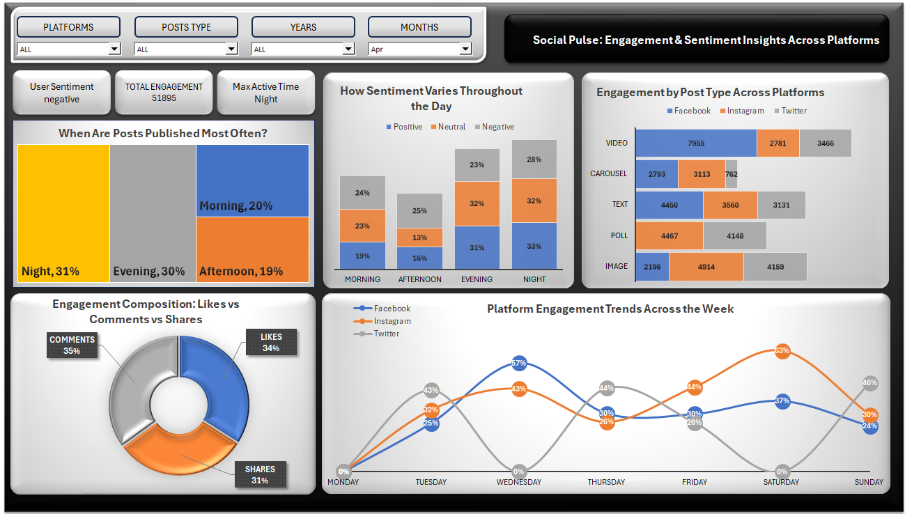

# 📊 Social Pulse: Engagement & Sentiment Insights (Excel Dashboard)

This Excel dashboard provides a detailed analysis of engagement and user sentiment trends across major social media platforms — Facebook, Instagram, and Twitter.

## 📈 Conclusions & Insights

- Most posts are published during **Night and Evening hours**
- **Negative sentiment** dominates late-night engagement
- **Videos perform best** across all three platforms in terms of engagement
- **Facebook dominates mid-week (especially Wednesday)**, while Instagram is strong on weekends
- Engagement is fairly distributed among Likes, Comments, and Shares

## 🔍 Key Features:
- 🕒 **Sentiment Breakdown by Time of Day** (Morning, Afternoon, Evening, Night)
- 📌 **Engagement by Post Type** across platforms
- 💬 **Engagement Composition**: Likes vs Comments vs Shares
- 📈 **Weekly Platform Engagement Trends**
- 🕹️ **Slicers for Platform, Post Type, Year, and Month**

## 🧰 Built With:
- Microsoft Excel
- Pivot Tables, Charts, Slicers, and Conditional Formatting, Developer tab tools

## 📌 Ideal For:
- Social Media Analysts
- Digital Marketers
- Business Analysts

## 📷 Dashboard Preview:

## 📄 Download Full Report (PDF)

[Click here to view the full dashboard PDF](./socialmedia.pdf)

## 👤 Created By

**Vikrant Ghale**  

